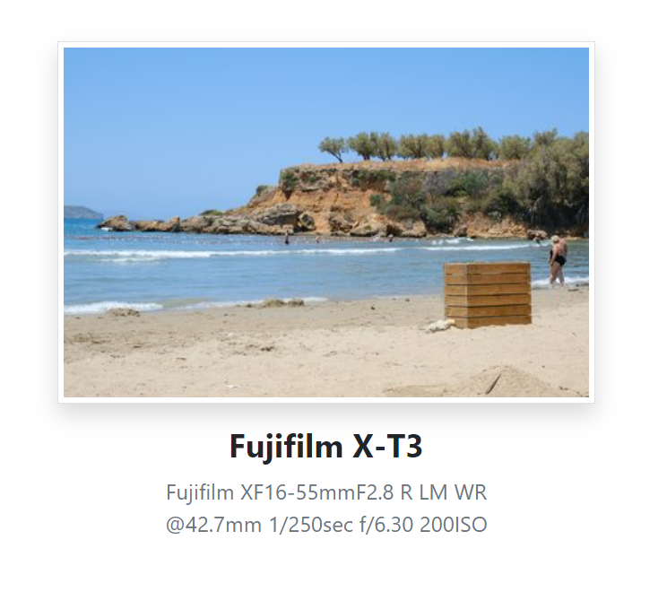
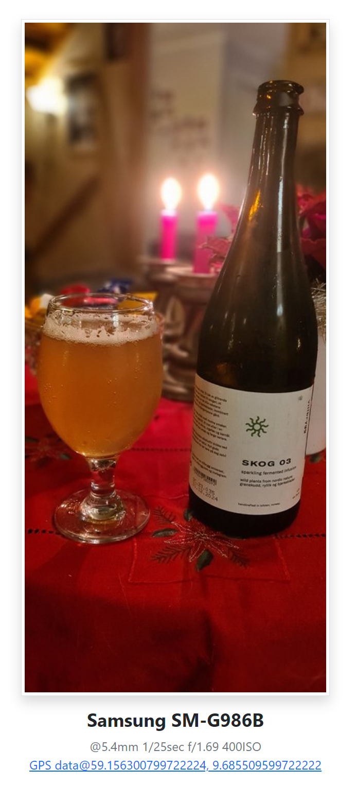

# Captions for Wagtail Images

A Django app for extending the Wagtail Image model to add captions and alt fields as
well as the extraction of IPTC image meta data.


## About this fork

This is a fork of the https://github.com/newshour/wagtailimagecaptions repo to add support for EXIF metadata like
camera make & model, aperture, shutter speed and iso rating. If present, GPS data will be processed as well, and
latitude and longitude willl be stored on the new model CaptionExifImage.



And for images with GPS information, latitude and longitude are available as well:



## Installing

Install using pip:

```sh
pip install wagtailimagecaptions
```

### Settings

In your settings file, add `wagtailimagecaptions` to `INSTALLED_APPS`:

```python
INSTALLED_APPS = [
    # ...
    "wagtailimagecaptions",
    # ...
]
```

You will also need to set a custom Image model in your setting files:

```python
# settings.py
WAGTAILIMAGES_IMAGE_MODEL = "wagtailimagecaptions.CaptionedImage"
```

To use the extended image model with EXIF data, change the lines above to:

```python
# settings.py
WAGTAILIMAGES_IMAGE_MODEL = "wagtailimagecaptions.CaptionedExifImage"
```

### Migrating

Heads up! If you have existing images, you will need to create a [data migration operation](https://docs.wagtail.org/en/latest/advanced_topics/images/custom_image_model.html#migrating-from-the-builtin-image-model) to move the old images into
the new model.

## How to Use

The custom Image model, `CaptionedImage`, adds four new fields to the Wagtail Image model: `alt`, `caption`, `credit`, `iptc_data`. When a new image is uploaded via Wagtail's media library, the app will attempt to extract any IPTC meta data found in the file and fill
the `alt`, `caption` and `credit` fields. All IPTC meta data  extracted is also stored in `iptc_data`.

This fork adds the mentioned custom Image model, `CaptionedExifImage`, which,  in addition to the extra fields above, adds `camera_make`, `camera_model`, `lens_make`, `lens_model`, `aperture`, `shutter_speed`, `iso_rating`, and if present, `latitude` and `longitude`. All extracted EXIF information is also stored as JSON in the `exif_data` field.

Example use in a template:

```python


{{ image.caption|richtext }}
```

#### Adding date paths to image uploads.

To add date paths to the image upload path, you can set `WAGTIALIMAGECAPTIONS_UPLOAD_TO_DATE_PATH` in your Django settings file with a valid date format.

```python
# settings.py
WAGTIALIMAGECAPTIONS_UPLOAD_TO_DATE_PATH = "%Y/%m"
```